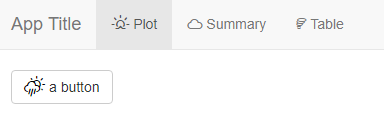
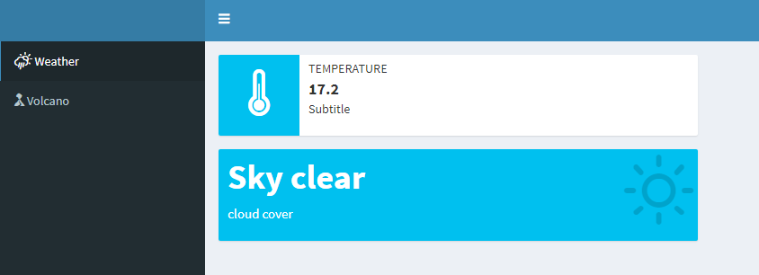

<!-- README.md is generated from README.Rmd. Please edit that file -->

```{r, include = FALSE}
knitr::opts_chunk$set(
  collapse = TRUE,
  comment = "#>",
  fig.path = "man/figures/README-",
  fig.retina = 2 ,
  out.width = "100%",
  message = FALSE, 
  warning = FALSE
)
```

# weather

<!-- badges: start -->
<!-- badges: end -->

> Use [weather-icons](https://erikflowers.github.io/weather-icons/) in ggplot2, markdown and shiny.


## Installation

You can install the development version from [GitHub](https://github.com/) with:

``` r
# install.packages("devtools")
devtools::install_github("dreamRs/weather")
```


## ggplot2

Plot weather icons with `geom_weather` :

```{r example-ggplot2, fig.height=3}
library(ggplot2)
library(weather)

df <- data.frame(
  hour = seq(as.POSIXct("2017-04-11"), by = "6 hour", length.out = 5),
  temperature = c(5, 4, 12, 10, 6),
  weather = c("night-clear", "day-rain-mix", 
              "day-cloudy", "day-sunny",
              "night-alt-cloudy")
)

ggplot(data = df) + 
  geom_line(aes(hour, temperature)) +
  geom_weather(aes(hour, temperature, weather = weather)) + 
  theme_minimal()
```

Icons available are listed in `weather_icon_names`.

Match popular weather API with icon names, for example with package [`darksky`](https://github.com/hrbrmstr/darksky) :

```{r weather-api}
library(darksky)
library(ggplot2)
library(weather)
now <- get_current_forecast(48.8566, 2.3522)

ggplot(now$hourly) + 
  geom_weather(
    aes(x = time, y = temperature, weather = icon), 
    api = "darksky"
  ) +
  labs(
    title = "Forecast for Paris",
    caption = "Data from darksky.net (via darksky package)"
  )
```


Or plot on a map:

```{r weather-map}
library(ggplot2)
library(weather)
library(darksky)
library(sf)
# devtools::install_github("antuki/CARTElette/CARTElette@RPackage")
library(CARTElette)

# Get forecast for some cities
fr_now <- mapply(
  FUN = function(latitude, longitude) {
    res <- get_current_forecast(
      latitude = latitude, 
      longitude = longitude, 
      exclude = "currently,minutely,hourly,alerts,flags"
    )
    res <- res$daily
    res$lat <- latitude
    res$lon <- longitude
    res
  },
  latitude = c(48.86, 43.31, 45.76, 43.62, 43.7, 47.23, 48.58, 43.61, 50.64, 
               44.84, 48.11, 49.25, 49.5, 45.43, 47.48), 
  longitude = c(2.34, 5.37, 4.83, 1.45, 7.27, -1.57, 7.76, 3.87, 3.07, -0.58, 
                -1.68, 4.03, 0.12, 4.39, -0.54),
  SIMPLIFY = FALSE
)
fr_now <- do.call("rbind", fr_now)
fr_tomorrow <- fr_now[as.character(fr_now$time) == Sys.Date() + 1, ]


# Load France polygons
france <- loadMap(nivsupra = "REG") 
france <- sf::st_transform(france, crs = 4326)

ggplot(data = france) + 
  geom_sf(fill = "white") + 
  geom_weather(
    data = fr_tomorrow,
    mapping = aes(lon, lat, weather = icon),
    api = "darksky"
  ) + 
  theme_minimal() + 
  labs(
    title = paste(
      "Prévisions du", 
      format(fr_tomorrow$time[1], format = "%A %d %B")
    ),
    subtitle = paste("à", format(Sys.time(), format = "%H:%M le %d/%m"))
  )
```


## rmarkdown and shiny

Display icons in rmarkdown document and shiny application with `weather_icon`. You can control size and color :

```{r, eval=FALSE}
weather_icon("day-sunny", size = "50px", color = "goldenrod")
```


Example in shiny:

```{r, eval=FALSE}
navbarPage(
  title = "App Title",
  tabPanel(
    title = "Plot", icon = weather_icon("sunrise"),
    actionButton("go", "a button", icon = weather_icon("day-rain"))
  ),
  tabPanel("Summary", icon = weather_icon("cloud")),
  tabPanel("Table", icon = weather_icon("tornado"))
)
```



In shinydashboard: 

```{r, eval=FALSE}
# In sidebar
menuItem("Weather", tabName = "Weather", icon = weather_icon("day-rain"))

# In infoBox
infoBox(
  "Temperature", "17.2", "Subtitle", icon = weather_icon("thermometer")
)

# In valueBox
valueBox(
  "Sky clear", "cloud cover", icon = weather_icon("day-sunny")
)
```





